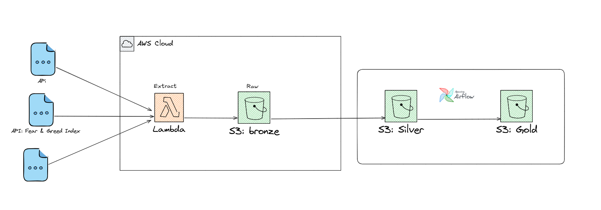

# Crypto Pipeline

Pipeline de dados de criptomoedas com arquitetura Bronze -> Silver -> Gold, usando AWS (S3, Lambda, EventBridge) e orquestracao local com Apache Airflow.

## Arquitetura



## Objetivo

Construir um pipeline realista para:

- Extrair dados de mercado de cripto em APIs publicas.
- Armazenar bruto (auditoria e reprocessamento) na camada Bronze.
- Aplicar regras de negocio na camada Silver.
- Gerar visoes analiticas na camada Gold.

## Fontes de Dados

- CoinGecko Markets
- CoinGecko Trending
- Fear & Greed Index (Alternative.me)

## Regras de Negocio Implementadas

### Silver

- Normalizacao de moeda para USD.
- Conversao de timestamp para formato legivel/ISO.
- Classificacao de variacao 24h:
  - alta: > 2%
  - queda: < -2%
  - estavel: entre -2% e 2%
- Marcacao de alta liquidez: volume > 1 bilhao USD.
- Remocao de duplicatas por (coin_id, timestamp).

### Gold

- Top 10 moedas por market cap do dia.
- Media movel de 7 observacoes de preco por moeda.
- Cruzamento Fear & Greed < 25 com moedas em alta.
- Ranking trending vs variacao real (hype vs realidade).

## Estrutura do Projeto

```text
crypto-pipeline/
|-- infra/                  # Terraform
|   |-- main.tf
|   |-- lambda.tf
|   |-- s3.tf
|   `-- variables.tf
|-- lambda/
|   |-- extractor.py        # Extracao e gravacao no S3 Bronze
|   `-- extractor.zip       # Gerado pelo Terraform
|-- dags/
|   `-- crypto_pipeline.py  # DAG Airflow
|-- transforms/
|   |-- s3_sync.py          # Sync S3 <-> data local
|   |-- silver.py           # Transformacao Silver
|   `-- gold.py             # Transformacao Gold
|-- data/                   # Bronze/Silver/Gold locais (Airflow)
|-- images/
|   `-- arch.png
|-- docker-compose.yaml
|-- .env
`-- README.md
```

## Provisionamento da Infra (Terraform)

Dentro de infra/:

```bash
terraform init
terraform plan
terraform apply
```

Recursos provisionados:

- Bucket S3 do Data Lake.
- Lambda de extracao.
- IAM role e policy da Lambda.
- EventBridge Rule para disparo periodico.

## Ambiente Local (Airflow)

No diretorio raiz:

```bash
docker compose up -d
```

Acesso UI:

- http://localhost:8080

## Variaveis de Ambiente

Arquivo .env (local, nao versionado):

- AIRFLOW_IMAGE_NAME
- AIRFLOW_UID
- AWS_DEFAULT_REGION
- S3_BUCKET_NAME
- AWS_ACCESS_KEY_ID
- AWS_SECRET_ACCESS_KEY
- AWS_SESSION_TOKEN (opcional para credencial temporaria)

## Fluxo End-to-End

1. Lambda grava Bronze no S3 em:
   - bronze/YYYY/MM/DD/coingecko_markets.json
   - bronze/YYYY/MM/DD/coingecko_trending.json
   - bronze/YYYY/MM/DD/fear_greed.json

2. DAG executa:
   - extract
   - sync_bronze_from_s3
   - transform_bronze_to_silver
   - transform_silver_to_gold
   - sync_silver_gold_to_s3
   - check_data_quality

3. Airflow salva localmente em data/ e publica no S3:
   - silver/YYYY/MM/DD/\*.json
   - gold/YYYY/MM/DD/\*.json

## Execucao Manual (Teste Rapido)

Exemplo para data 2026-06-25:

```bash
# pull bronze do S3
docker compose exec -T airflow-scheduler python /opt/airflow/transforms/s3_sync.py pull 2026-06-25

# gerar silver e gold
docker compose exec -T airflow-scheduler python /opt/airflow/transforms/silver.py 2026-06-25
docker compose exec -T airflow-scheduler python /opt/airflow/transforms/gold.py 2026-06-25

# publicar silver/gold no S3
docker compose exec -T airflow-scheduler python /opt/airflow/transforms/s3_sync.py push 2026-06-25
```

## Seguranca e Sigilo

- Nunca versionar chaves AWS, tokens, state Terraform e logs.
- .env deve ficar apenas local.
- Se qualquer credencial for exposta, revogar e rotacionar imediatamente.

## Troubleshooting

- Erro de DAG import (Airflow 3): usar schedule em vez de schedule_interval.
- Erro de path no Git Bash com docker compose exec:
  - usar MSYS_NO_PATHCONV=1 antes do comando.
- Erro Bronze ausente no Silver:
  - verificar se Lambda escreveu no prefixo bronze da data da execucao.
  - rodar pull com a data correta.
